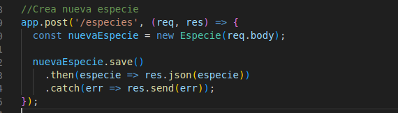

# Proyecto
Este es un proyecto de una API para la insercion y recuperacion de datos mediante Node.js a la base de datos MongoDb instalado localmente.

## Tecnologias utilizadas

[](https://nodejs.org/)
[](https://expressjs.com/)
[](https://mongoosejs.com/)

## Instalación del Proyecto

Para poner en marcha este proyecto, sigue los siguientes pasos de instalación:

#### 1. Instala npm:
```bash
sudo apt install npm
```
#### 2. Instala mongoose version 5.10.10:
Mongoose es la biblioteca de modelado de objetos para Node.js y MongoDB que proporciona una solución más fácil y eficiente para interactuar con bases de datos MongoDB desde una aplicación Node.js.
```bash
npm install mongoose@5.10.10
```
#### 3. Instala mongodb:
Controlador oficial de MongoDB para Node.js que permite a la aplicación Node.js conectarse a una base de datos MongoDB. Proporciona las herramientas necesarias para establecer y gestionar conexiones con la base de datos.
```bash
npm install mongodb
```
#### 4. Instala Express:
Para instalar el framework web Express.js proporcionar una estructura y una serie de herramientas para manejar rutas, vistas, y otros aspectos comunes de la Api.
```bash
npm install express
```
#### 5. Ejecucion del proyecto:
Para ejecutar el proyecto, utilizar el siguiente comando
```bash
node proyectomongo1/Back/app.js
```

## Funcionalidades de la Api
En esta Api se cuenta con las diferentes funcionalidades:
estructura de datos

### Modelo de los datos:
Los datos a insertar de la Api se componen de los siguientes datos
- name : En referencia a nombre
- description : En referencia a la descripcion


### Get:
Esta Api cuenta con dos formas de mostrar los datos:

#### Get: para obtener todos los datos
Para obtener todos los datos:


Ejemplo en Postman


#### Get: para obtener datos mediante busqueda por id
Para obtener los datos de un modelo a partir de su id:


Ejemplo en Postman


### Post:
Para insertar datos en la base de datos:



Ejemplo en Postman


### Put:
Para modificar los datos de un modelo en base a su id:


Ejemplo en Postman


### Delete:
Para eliminar un modelo de datos en base a su id:


Ejemplo en Postman


